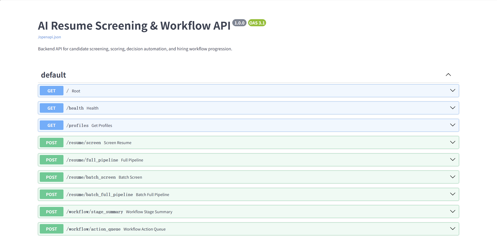
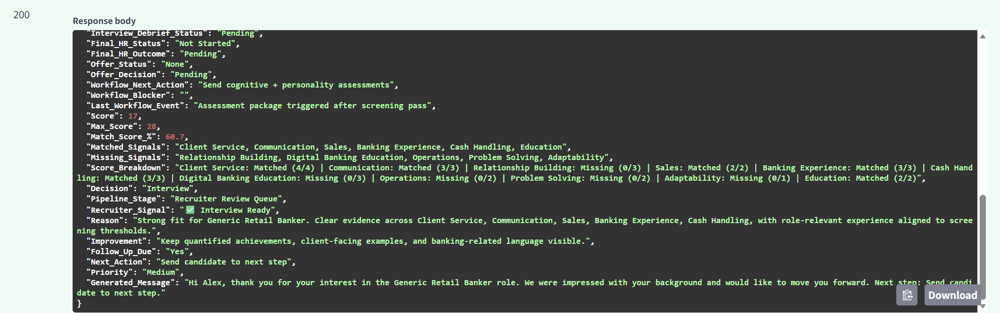

# 🚀 AI-Powered Decision System for Workflow Optimization

## 📌 Overview
This project is a Python-based system that evaluates candidate-job fit by transforming unstructured resume data into a structured scoring framework.

It models candidate evaluation as a **ranking and classification problem**, enabling consistent, data-driven comparison across multiple candidates.

More importantly, this project is designed as a **recruiting decision system prototype**, simulating how candidate data flows through scoring, ranking, and decision routing (interview, hold, rejection) in a real-world hiring pipeline.

---

## 🧠 Key Concepts
- Feature engineering from unstructured data  
- Rule-based scoring as a baseline model  
- Candidate ranking and classification  
- Handling real-world data variability
- Workflow and decision system design for recruiting pipelines

---

🗄️ Data Extraction (SQL Integration)

Candidate data is first queried using SQL to simulate extraction from a structured database, then processed using Pandas.

```sql
SELECT 
  c.candidate_id,
  c.skills,
  c.years_experience,
  j.required_skills
FROM candidates c
JOIN jobs j
  ON c.job_id = j.job_id
WHERE c.years_experience IS NOT NULL;
```

This step reflects how real-world systems retrieve and filter structured data before downstream processing.

---

## ⚙️ Features
- Processes and structures candidate data using **Pandas**  
- Matches candidate skills against job requirements  
- Computes scores based on **skill alignment and experience**  
- Ranks candidates from strongest to weakest fit  
- Produces standardized outputs for consistent evaluation  

---

## 🧮 Scoring Model
- **+2 points** per matching required skill  
- **+1 point** per year of relevant experience

---

## 🧭 Decision Policy
After scoring, candidates are routed into decision buckets:

- **High-score candidates** → move directly to **Interview**
- **Mid-score candidates** → placed on **Hold** for re-evaluation
- **Low-score candidates** → receive automated **Rejection**
- **Hold candidates** may later move forward or be rejected depending on:
  - stronger incoming candidates
  - pipeline capacity
  - role urgency
  - hiring volume

This reflects how recruiting decisions are often made in real workflows: not only based on absolute score, but also based on relative comparison within an active pipeline.
These decisions determine candidate routing into different stages of the recruiting pipeline (e.g., assessment, recruiter screen, or interview).

---

## 🧩 Candidate Pipeline States

Candidates move through multiple states in the recruiting pipeline:

- Applied → initial entry into the system  
- Screened → evaluated based on resume scoring  
- Interview → selected for further evaluation  
- Hold → temporarily paused for comparison with stronger candidates  
- Rejected → not selected for current role  
- Offer → selected for hiring  

This reflects a more realistic hiring pipeline rather than a simple one-step decision.

---
## ⚖️ Dynamic Decision Logic

Decisions are not static and depend on pipeline context:

- Mid-tier candidates may be placed on **Hold**  
- If stronger candidates enter the pipeline, they may be **rejected**  
- If no stronger candidates are available after a period of time, they may be **moved to Interview**  

This simulates real-world hiring behavior where decisions depend on relative candidate strength and hiring capacity.

---

## 🪜 Multi-Stage Evaluation Workflow

The recruiting system can be extended beyond resume screening into a multi-stage candidate evaluation process.

### Stage 1: Resume Screening
- Candidates are scored based on skill alignment, experience, and rule-based matching
- Only candidates above a defined threshold move forward

### Stage 2: Assessment Screening
- Candidates who pass the resume screen receive an online assessment
- Candidates scoring **85% or above** move to the next stage
- Candidates below the threshold are filtered out or placed on hold depending on pipeline needs

### Stage 3: Recruiter Phone Screen
- Candidates are evaluated by a recruiter using a structured scorecard
- Example decision rule:
  - **9/10 or above** → move to interview
  - **7–8/10** → hold for comparison
  - **below 7/10** → reject

### Stage 4: Interview Progression
- Candidates who pass the recruiter screen advance to formal interviews
- Final outcomes depend on both stage performance and pipeline context

This structure reflects a more realistic hiring workflow where decisions are made across multiple evaluation layers rather than from resume screening alone.

---

## 🔄 System Processing Workflow
The system follows this pipeline:

`Candidate Data -> Feature Extraction -> Scoring -> Ranking -> Decision Bucket -> Communication Action`

### Workflow Stages
1. **Candidate Data Input**
2. **Feature Extraction**
3. **Score Calculation**
4. **Ranking**
5. **Decision Routing** (`Interview / Hold / Reject`)
6. **Next-Step Communication**

---

## 🤖 Automation Layer

The system can be extended to automate key recruiting actions:

- Automatically send interview invitations for high-scoring candidates  
- Trigger follow-up messages for candidates on hold  
- Send rejection emails for low-scoring candidates  
- Track pipeline metrics such as interview rate and rejection rate  

This reduces manual workload and improves recruiting efficiency at scale.

---

## ⏱️ Response Timing & Candidate Communication

To improve candidate experience and maintain pipeline momentum, the system can incorporate response timing rules:

- **High-score candidates** → contacted within 24 hours for interview scheduling  
- **Mid-tier candidates (Hold)** → receive status updates within 2–3 days to keep engagement  
- **Low-score candidates** → receive automated rejection within 24–48 hours  

The system can also trigger follow-ups:
- Reminder emails if candidates do not respond  
- Re-evaluation of held candidates after a defined time window  

This ensures that candidates are not left waiting and helps maintain a responsive and efficient recruiting process.

---

## 📩 Candidate Communication Templates

The system supports automated communication templates to ensure consistency and professionalism across candidate interactions.

### Rejection Communication
- Generates polite and neutral rejection messages
- Avoids providing overly specific reasons to reduce legal and bias risks
- Ensures candidates feel respected and acknowledged

### Advancement Communication
- Notifies candidates when they move to the next stage
- Provides clear next steps (e.g., assessment, phone screen, interview)
- Maintains a positive and engaging tone

### Design Considerations
- Use standardized templates with dynamic variables (e.g., candidate name, role)
- Ensure tone is consistent across all stages
- Balance automation with human review when necessary

This approach ensures scalable communication while maintaining a strong candidate experience.

---

## 👤 Candidate Experience Layer

The system can be extended to provide transparency to candidates by allowing them to track their application status.

Possible features include:
- Real-time status updates (Applied, Screened, Interview, Hold, Rejected, Offer)
- Notifications when status changes
- Estimated response timelines based on pipeline stage
- Reduced uncertainty and improved candidate experience

This helps create a more transparent and responsive hiring process, which is critical in high-volume recruiting environments.

---

## 📊 Example Output

| Name  | Score | Decision  |
|-------|-------|-----------|
| Cathy | 11    | Interview |
| Alex  | 9     | Hold      |
| Brian | 6     | Reject    |

---

## 🧪 Real-World Validation
- Evaluated system using **20+ real candidate profiles**  
- Tested across **50+ simulated scenarios**  
- Identified edge cases such as:
  - Strong candidates under-ranked due to missing keywords  
  - Inconsistent resume formatting affecting evaluation  
- Refined scoring logic to improve **consistency and robustness**  

---

## 🛠️ Tech Stack
- Python  
- Pandas  
- scikit-learn  

---

## 📁 Project Structure

recruiting-decision-system/
│── resume_scoring.py
│── data/
│ └── sample_candidates.csv
│── README.md


---

## ▶️ How to Run

pip install pandas scikit-learn
python resume_scoring.py


---

## 💡 Example Use Case
Given a dataset of candidates and job requirements, the system:
1. Extracts structured features  
2. Computes candidate scores  
3. Ranks candidates  
4. Outputs standardized decisions  

---

## 🤖 Extension
This project includes a baseline supervised machine learning model using Logistic Regression as an **extension to the rule-based system**.

The workflow includes:
- preprocessing structured candidate features  
- one-hot encoding categorical variables  
- splitting data into training and test sets  
- training a classification model to predict candidate fit  
- evaluating performance using **accuracy, precision, and recall**  

**Model Performance:**
- Accuracy: ~0.80  

This extension demonstrates how a rule-based system can evolve into a more adaptive, data-driven approach to reduce false negatives and improve candidate matching.

---

## 📈 Impact
- Standardizes candidate evaluation  
- Reduces subjective bias in screening  
- Improves efficiency in comparing candidates  
- Simulates real-world decision workflows  

---

## ⚠️ Current Limitations
- Keyword-based scoring may under-rank strong candidates with unconventional resume wording
- Resume formatting inconsistencies can affect extracted features
- The current system runs as an offline prototype and is not yet integrated with a live ATS
- Mid-tier candidate decisions still depend on configurable business rules and pipeline context

---

## 🔄 Future Improvements
- Integrate with an ATS or structured recruiting database
- Add recruiter-facing dashboard for pipeline visibility
- Trigger automated follow-up communication based on candidate status
- Add semantic matching / NLP for deeper resume-job alignment
- Support recruiter override decisions and audit logs
- Expand the system into a multi-stage evaluation workflow beyond resume screening 

---

## 🎯 Purpose
This project demonstrates:
- Translating real-world recruiting workflows into structured, data-driven systems  
- Designing scalable decision-making pipelines using Python  
- Applying machine learning as an extension to operational systems  
- Building AI-assisted workflows for high-efficiency recruiting operations  

---

## 📌 Demo
See `resume_scoring.py` for a sample implementation and output.

---

## 🔍 API Demo

### Swagger UI



---

### Example Output


